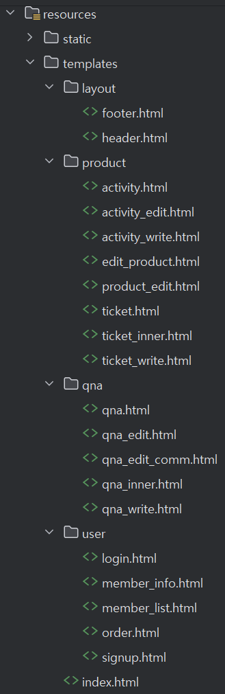
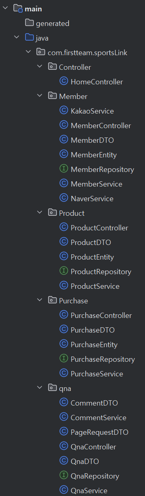

# 프로젝트 개발환경

## 개요
- 학원 어플리케이션 개발부분을 위한 포트폴리오용 프로젝트
- 프로젝트 완성 후 클라우드 환경에 AWS 인프라를 구성 및 배포 테스트 예정

## 개발환경(IDE)
- IntelliJ IDEA Community 2024.1.1
- Visual Studio Code 1.89.1
- MySQL 8.0 Client
- MySQL Workbench 8.0 CE
- Git Hub

## 기술 스택
- Spring Boot 3.2.5
- JDK 17
- MySQL / driver ==> 버전 8.0.37
- Spring Data JPA
- Thymeleaf
- JavaScript ECMAScript 6+

## 시나리오
이 플랫폼은 다음과 같은 사용자들을 위해 설계되었습니다:
- 각종 스포츠 활동을 보다 저렴하게 이용하고 싶은 사람
- 혼자서 하기 어렵거나 여러 명이서 스포츠 활동을 하고 싶은 사람
### 주요 기능
- 보다 합리적인 스포츠 상품들을 선별 및 제공
- 공동 구매 혹은 단체 구매 상품들을 저렴하게 제공
- 사용자 주변의 스포츠 활동과 시설 정보를 확인할 수 있는 기능 제공

## 기능 구현
### 회원 기능 (정식)
- 로그인 (세션 로그인 방식)
  - 홈페이지 로그인
  - 카카오 로그인
  - 네이버 로그인
- 회원가입
  - 홈페이지 회원가입
  - 카카오, 네이버 로그인시 자동 회원가입
- 회원정보수정
  - 전화번호 수정(카카오는 회원정보 이름, 이메일만 가능)
  - 본인 정보만 수정할 수 있도록 설정
- 회원 목록
  - 모든 회원 정보를 게시판 형태로 표시
  - 관리자만 접근 가능
- 관리자 기능
  - 문의사항 댓글작성, 상품 관리, 회원 관리 부분
  - 일반 사용자는 안보이도록 설정
### 문의 기능 (고은)
- 소제목
    - 내용
### 상품 주문 기능 (상우)
- 소제목
    - 내용
## 프론트 구조(고은)


## 패키지 구조


## DB ERD
[SportsLink ERD](https://www.erdcloud.com/d/GJQ9izRgagonJiAQh)


  ## DB본인 컴퓨터에 설치된 DB적용시
- application.yml 파일에 주석처리로 변경사항 적용 안내
- DB버전 및 DB이름 통일 필요할듯 논의 후 결정 (현파일 데이터 베이스이름 : sportslink )

### 마리아DB로 변경하려면 다음과 같이 데이터베이스 URL과 드라이버 클래스 이름을 변경

```
spring:
datasource:
driver-class-name: org.mariadb.jdbc.Driver
url: jdbc:mariadb://localhost:3306/sportslink?serverTimezone=Asia/Seoul&characterEncoding=UTF-8
username: root
password: 1234
thymeleaf:
cache: false
jpa:
database-platform: org.hibernate.dialect.MariaDBDialect
open-in-view: false
show-sql: true
hibernate:
ddl-auto: update
```
